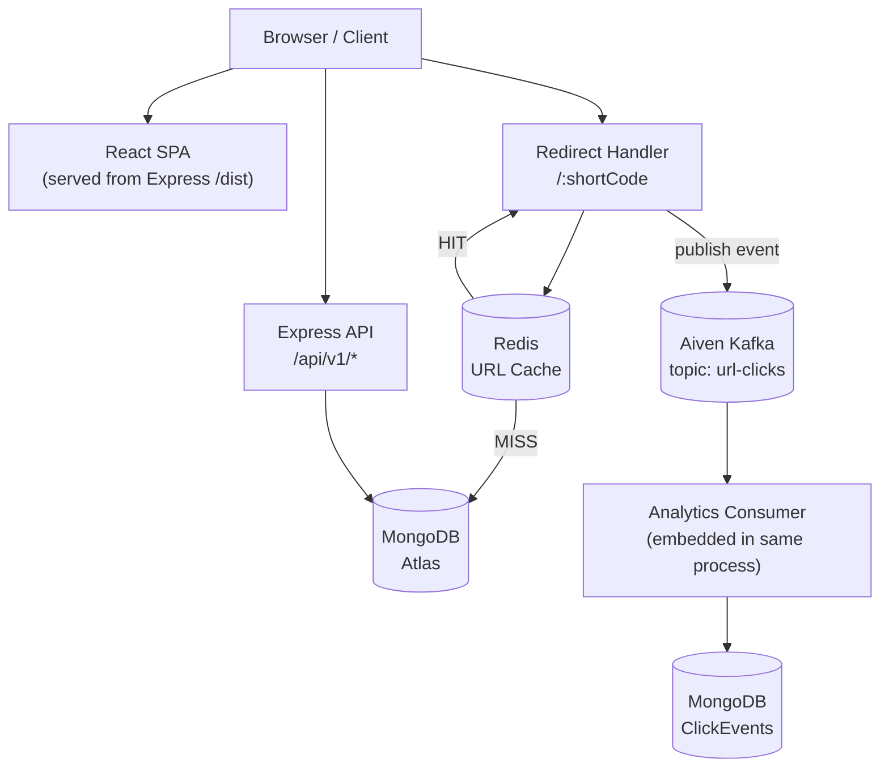

# LinkForge

A full-stack URL shortener with click analytics, password-protected links, and Google OAuth — built to learn how real backend systems are designed and deployed.

---

## Live Demo

> [LinkForge](https://linkforge-ad9d.onrender.com/)

---

## Why I Built This

Most URL shortener tutorials stop at generating a short code and redirecting. I wanted to understand what happens after that: how do you track analytics without slowing down the redirect? How do you handle sessions securely? What breaks when you deploy behind a reverse proxy?

LinkForge is the result of actually building and deploying those answers rather than just reading about them.

---

## Features

- **URL shortening** — 8-character base-62 codes generated with nanoid
- **Custom aliases** — 3–30 character slugs (`[a-zA-Z0-9_-]`)
- **URL expiration** — set a datetime after which the link stops working
- **Password-protected links** — bcrypt-hashed passwords, separate access endpoint with rate limiting
- **Soft deletion with grace period** — URLs enter a 30-day pending state before permanent removal; restorable during that window
- **Link management** — activate/deactivate, edit destination URL, update expiry, toggle password protection
- **Click analytics** — total clicks, clicks over time, per-day breakdown, device breakdown, browser breakdown, country breakdown
- **Email/password auth** — registration, login, logout (current session or all devices)
- **Google OAuth** — CSRF-protected via state parameter, links Google identity to existing local accounts
- **JWT + refresh token rotation** — short-lived access tokens, rotating refresh tokens, token reuse detection
- **Session management** — every login creates a tracked session; logout marks it as revoked
- **Redis caching** — redirect path checks Redis before hitting MongoDB
- **Async analytics via Kafka** — click events are published to Kafka and consumed separately; redirect is not blocked
- **Rate limiting** — four distinct limiters with different thresholds per route type

---

## Tech Stack

**Frontend**
- React 19, React Router v7
- Axios (with 401 interceptor for silent token refresh)
- Recharts (analytics charts)
- Vite (build tool)
- Vanilla CSS

**Backend**
- Node.js, Express 5
- Zod (request validation)
- jsonwebtoken (JWT access + refresh tokens)
- bcrypt (password hashing)
- nanoid (short code generation)
- geoip-lite (IP → country lookup)
- morgan (HTTP request logging)
- Helmet (HTTP security headers)
- express-rate-limit

**Database**
- MongoDB (via Mongoose)

**Caching**
- Redis (redirect cache, 1-hour default TTL)

**Messaging**
- Kafka (KafkaJS) — Aiven-hosted in production, SASL/SSL auth

**Authentication**
- JWT (access tokens: 15m, refresh tokens: 30d)
- Google OAuth 2.0 (`google-auth-library`)
- HTTP-only cookies for all tokens

**Deployment / Infrastructure**
- Render (single web service for backend + React build)
- MongoDB Atlas
- Aiven Kafka
- Redis (configured via `REDIS_URL`)

---

## Architecture

LinkForge is a **modular monolith**. The backend is a single Node.js process that handles:
- The Express API
- Serving the React production build
- The Kafka analytics consumer (embedded, runs in the background)

It is modular in that the code is cleanly separated into layers — routes, controllers, services, models, middleware — but there is no separate analytics service or redirect service. Everything runs inside one Render web service.

This was a deliberate tradeoff. Render's free tier supports one web service. Running the analytics consumer in a separate process would require a second paid service or a cron job. Instead, the consumer is started alongside the Express server and reconnects automatically if Kafka is temporarily unavailable.



---

## Request & Data Flow

### A. Creating a Short URL

```
POST /api/v1/urls
  → authenticate middleware verifies access token from cookie
  → controller extracts originalUrl, customAlias, expiresAt, password
  → url.service: validates URL, validates alias, hashes password (if set)
  → generates 8-char base-62 code (retries on collision)
  → saves ShortUrl document to MongoDB
  → returns shortUrl object to client
```

### B. Redirecting (Cache HIT)

```
GET /:shortCode
  → redirectLimiter (300 req / 15 min per IP)
  → cache.service: check Redis key "shorturl:{shortCode}"
  → Redis returns { urlId, originalUrl }
  → controller collects analytics (IP, UA, referrer, device, browser, country)
  → publishes URL_CLICKED event to Kafka (non-blocking, fire-and-forget)
  → res.redirect(302, originalUrl)
```

### C. Redirecting (Cache MISS)

```
GET /:shortCode
  → cache.service: Redis returns null
  → url.service: ShortUrl.findOne({ shortCode }).lean()
  → validates: isActive, not expired, not password-protected
  → calculates TTL: min(3600, secondsUntilExpiry)
  → writes { urlId, originalUrl } to Redis with TTL
  → analytics publish + redirect (same as HIT path)
```

Password-protected URLs are never placed in the Redis cache — they always go through the password verification endpoint instead.

### D. Click Event → Kafka → MongoDB

```
redirect handler
  → publishUrlClicked(event)             [kafka.service]
  → producer.send({ topic: "url-clicks", messages: [JSON event] })

  [async loop, same process]
  → consumer.run → eachMessage handler
  → saveClickEvent(event)                [analytics.service]
  → ClickEvent.create({ eventId, urlId, shortCode, device, browser, country, ... })
  → duplicate eventId (unique index) → silently ignored
```

If Kafka is unavailable, `publishUrlClicked` checks `producerConnected` and logs the failure without throwing. The redirect still completes. The analytics consumer retries connection on a 5-second loop.

### E. Email/Password Authentication

```
POST /api/v1/auth/login
  → authLimiter (10 req / 15 min per IP)
  → validate(loginSchema) [Zod]
  → auth.service.login: find user, comparePassword (bcrypt)
  → generate accessToken (JWT, 15m) + refreshToken (JWT, 30d, includes sessionId)
  → MongoDB transaction: create Session (hashed refreshToken, deviceInfo, IP)
  → setAuthCookies(res, accessToken, refreshToken) [httpOnly, secure in prod]
  → return user data
```

### F. Refresh Token Flow

```
POST /api/v1/auth/refresh
  → authLimiter
  → read refreshToken from httpOnly cookie
  → verifyRefreshToken (JWT signature + expiry)
  → validate payload.sub (userId) and payload.sid (sessionId)
  → find user
  → generate new accessToken + new refreshToken (same sessionId)
  → hash old token and new token
  → MongoDB transaction: compare session.refreshTokenHash === hash(oldToken)
    → mismatch → REFRESH_TOKEN_REUSE detected → revoke session → 401
    → match    → update session.refreshTokenHash = hash(newToken)
  → setAuthCookies with new tokens
```

The Axios client deduplicates concurrent refresh calls using a shared `refreshPromise` — if multiple requests fail with 401 simultaneously, only one refresh call goes to the server.

### G. Google OAuth Flow

```
GET /api/v1/auth/google
  → authLimiter
  → generate 32-byte random state (crypto.randomBytes)
  → store state in httpOnly cookie (10-min TTL)
  → redirect to Google's authorization URL (includes state param)

  [user authenticates with Google]

GET /api/v1/auth/google/callback?code=...&state=...
  → compare state param with cookie value (CSRF protection)
  → exchangeCodeForTokens → verify Google ID token
  → find or create local user (links Google to existing email account if found)
  → create LinkForge session
  → setAuthCookies
  → redirect to /dashboard
```

---

## Redis

The only thing cached in Redis is the redirect lookup: the mapping from `shortCode` to `{ urlId, originalUrl }`.

**Why:** MongoDB lookups involve disk I/O and network round-trips. For a redirect, users expect near-instant response. Serving the redirect target from an in-memory store removes the database from the hot path entirely.

**Cache key:** `shorturl:{shortCode}`  
**Default TTL:** 1 hour. For URLs that expire sooner, TTL is capped to `Math.min(3600, secondsUntilExpiry)`.  
**Cache miss:** Service falls through to MongoDB, validates the URL, then populates Redis.  
**Password-protected URLs:** Never cached — they require a password verification step.  
**Cache invalidation:** When a URL is updated or a deletion is requested, `invalidateUrlCache(shortCode)` deletes the Redis key immediately.  
**Redis failure:** The cache layer is wrapped in try/catch. If Redis is unavailable, every request falls back to MongoDB — slower, but the service keeps working.

---

## Kafka

**Why async analytics:** If the analytics write happened synchronously inside the redirect handler, a slow MongoDB write or traffic spike would directly increase redirect latency. Kafka decouples the two — the redirect publishes a lightweight message and returns immediately.

**Producer:** Initialized alongside the Express server. Connects in the background and sets a `producerConnected` flag. If unavailable, `publishUrlClicked` logs the failure and returns without throwing.

**Topic:** `url-clicks`

**Consumer group:** `linkforge-analytics`

**Consumer:** Runs an infinite retry loop inside `analytics.worker.js`. Connects to Kafka, subscribes to `url-clicks`, and calls `saveClickEvent` for each message. On disconnect, waits 5 seconds and retries. `stopAnalyticsWorker` sets a shutdown flag and disconnects cleanly on SIGTERM/SIGINT.

**Duplicate handling:** Each event carries a UUID (`eventId`). MongoDB has a unique index on `ClickEvent.eventId`. Redelivered Kafka messages fail with a MongoDB error code `11000` and are silently ignored.

**Provider:** Aiven Kafka in production. Connection uses SASL/plain + SSL, applied conditionally in `kafka.js` when `KAFKA_USERNAME` and `KAFKA_PASSWORD` are present.

---

## Authentication & Security

### JWT

- **Access token:** 15-minute expiry (configurable). Payload: `{ sub: userId, role }`.
- **Refresh token:** 30-day expiry (configurable). Payload: `{ sub: userId, sid: sessionId }`.
- Both issued as HTTP-only cookies. In production: `secure: true`, `sameSite: "none"`.

### Refresh Token Rotation

Every `/auth/refresh` call issues a new refresh token and atomically updates the session's stored hash. If a previously rotated token is used again — indicating it may have been stolen — the hash comparison fails, the session is immediately revoked, and all tokens for that session stop working.

### Sessions

Each login creates a `Session` document storing: `userId`, `refreshTokenHash` (SHA-256 of the token), `status` (ACTIVE/REVOKED), `deviceInfo`, `ipAddress`, `expiresAt`. Logout revokes the session. "Logout from all devices" revokes all active sessions for the user.

The raw refresh token is never stored — only its SHA-256 hash.

### Google OAuth CSRF Protection

On OAuth initiation, a 32-byte random hex string is generated and stored in an httpOnly cookie with a 10-minute TTL. The callback validates `state` query param against the cookie. Mismatch → 401.

### Password Hashing

Both user account passwords and short URL passwords use bcrypt (`hashPassword` / `comparePassword` in `utils/crypto.js`).

### Helmet

Configured with HSTS (`strictTransportSecurity`) only when `NODE_ENV === "production"`, since local development runs over HTTP.

### CORS

Allowed origins: `http://localhost:5173` (local dev) and `FRONTEND_URL` (production). Requests without an `Origin` header are allowed.

### Rate Limiting

| Limiter | Routes | Limit |
|---|---|---|
| `authLimiter` | `/auth/login`, `/auth/register`, `/auth/google`, `/auth/refresh` | 10 req / 15 min / IP |
| `passwordLimiter` | `POST /urls/access/:shortCode` | 10 req / 15 min / IP |
| `apiLimiter` | All `/api/v1/urls/*` | 100 req / 15 min / IP |
| `redirectLimiter` | `GET /:shortCode` | 300 req / 15 min / IP |

`/auth/me` and `/auth/logout` are deliberately excluded from `authLimiter`. `/auth/me` is called on every page transition and must not be rate-limited.

### Proxy IP Handling

`app.set("trust proxy", 1)` trusts exactly one proxy hop — Render's load balancer. The redirect controller explicitly parses `x-forwarded-for` and takes the first value, since `req.ip` alone can return the internal proxy address in some Render routing scenarios.

---

## API Overview

All API routes are prefixed `/api/v1`.

**Auth**
- `POST /auth/register` — create account
- `POST /auth/login` — login, issues cookies
- `POST /auth/logout` — revoke current session
- `POST /auth/logout-all` — revoke all sessions
- `POST /auth/refresh` — rotate refresh token
- `GET /auth/me` — get current user
- `GET /auth/google` — initiate Google OAuth
- `GET /auth/google/callback` — Google OAuth callback

**URLs** (all require auth)
- `POST /urls` — create short URL
- `GET /urls` — list user's URLs (paginated, searchable)
- `GET /urls/:id` — get single URL
- `PATCH /urls/:id` — update (destination, expiry, active state, password)
- `POST /urls/:id/delete` — request soft deletion (30-day grace period)
- `POST /urls/:id/restore` — cancel deletion request

**Analytics** (require auth)
- `GET /urls/:id/analytics?period=7d` — click stats for a period
- `GET /urls/:id/analytics/date?date=YYYY-MM-DD` — stats for a specific day

**Password-protected access** (no auth required)
- `POST /urls/access/:shortCode` — verify password, returns original URL

**Redirect** (public)
- `GET /:shortCode` — redirect to original URL

**Health**
- `GET /health`

---

## Database Models

**User** — `name`, `email`, `passwordHash`, `authProvider` (LOCAL | GOOGLE), `googleId`, `emailVerified`. Unique index on `email`, sparse unique on `googleId`.

**Session** — `userId`, `refreshTokenHash`, `status` (ACTIVE | REVOKED), `deviceInfo` (browser, os), `ipAddress`, `userAgent`, `expiresAt`, `lastUsedAt`. Indexed on `userId` and `refreshTokenHash`.

**ShortUrl** — `userId`, `originalUrl`, `shortCode`, `isActive`, `expiresAt`, `deletionRequestedAt`, `isPasswordProtected`, `passwordHash`. Compound indexes: `(shortCode, isActive)`, `(userId, createdAt desc)`, `(deletionRequestedAt)`.

**ClickEvent** — `eventId` (UUID, unique), `urlId`, `shortCode`, `timestamp`, `ipAddress`, `userAgent`, `referrer`, `country`, `device` (desktop | mobile | tablet | unknown), `browser`. Compound index: `(urlId, timestamp desc)`.

---

## Project Structure

```
linkforge/
├── backend/
│   └── src/
│       ├── app.js              # Express setup, middleware stack, routing order
│       ├── server.js           # Entry: DB, Redis, Kafka, HTTP server, graceful shutdown
│       ├── config/             # db.js, redis.js, kafka.js, google.js, env.js, logger.js
│       ├── constants/          # AUTH_PROVIDERS, SESSION_STATUS/ERRORS, USER_ROLES
│       ├── controllers/        # auth.controller.js, url.controller.js
│       ├── middleware/         # authenticate, validate, rateLimit, error, notFound
│       ├── models/             # User, Session, ShortUrl, ClickEvent
│       ├── routes/             # auth, url, redirect, health
│       ├── services/           # auth, token, session, url, cache, kafka,
│       │                       # analytics, cleanup, google
│       ├── utils/              # ApiError, ApiResponse, asyncHandler, cookies,
│       │                       # crypto, date, duration, geoLocation, oauth,
│       │                       # shortCode, userAgent
│       ├── validators/         # auth.validator.js (Zod), url.validator.js
│       └── workers/
│           ├── analytics.worker.js   # Kafka consumer, runs embedded in server process
│           └── cleanup.worker.js     # Permanent deletion after 30-day grace period
│                                     # (not scheduled automatically in production)
└── frontend/
    └── src/
        ├── api/                # auth.api.js, url.api.js, client.js (Axios + interceptor)
        ├── components/         # Navbar, Footer, Hero, HowItWorks, LinkFeatures,
        │                       # AnalyticsPreview, CTA, ProductPreview
        ├── layouts/            # DashboardLayout.jsx (sidebar, auth-aware)
        ├── pages/
        │   ├── Home.jsx
        │   ├── Login.jsx
        │   ├── Register.jsx
        │   ├── ProtectedUrl.jsx     # Password form for protected short links
        │   ├── UrlUnavailable.jsx   # Shown for expired/deactivated/not-found links
        │   └── dashboard/
        │       ├── Dashboard.jsx    # Overview + create link form
        │       ├── MyUrls.jsx       # URL table: edit, delete, restore (modal UI)
        │       └── Analytics.jsx    # Charts: clicks over time, device, browser, country
        ├── App.jsx             # React Router route definitions
        └── index.css           # All styles (vanilla CSS)
```

---

## Local Development Setup

### Prerequisites

- Node.js 18+
- MongoDB (Atlas free tier or local)
- Redis (local or cloud)
- Kafka broker (optional — analytics won't record without it, but the app runs)
- Google OAuth credentials (optional — Google login won't work without them)

### Clone

```bash
git clone https://github.com/JainAtishya/linkforge.git
cd linkforge
```

### Backend

```bash
cd backend
npm install
```

Create `backend/.env`:

```env
PORT=5000
NODE_ENV=development

MONGO_URI=your_mongodb_connection_string

ACCESS_TOKEN_SECRET=pick_a_random_secret
REFRESH_TOKEN_SECRET=pick_another_random_secret
ACCESS_TOKEN_EXPIRY=15m
REFRESH_TOKEN_EXPIRY=30d

REDIS_URL=redis://localhost:6379

GOOGLE_CLIENT_ID=your_google_client_id
GOOGLE_CLIENT_SECRET=your_google_client_secret
GOOGLE_REDIRECT_URI=http://localhost:5000/api/v1/auth/google/callback

APP_BASE_URL=http://localhost:5000
FRONTEND_URL=http://localhost:5173

KAFKA_BROKER=localhost:9092
KAFKA_USERNAME=
KAFKA_PASSWORD=
```

```bash
npm run dev
```

### Frontend

```bash
cd frontend
npm install
npm run dev
```

`frontend/.env` is pre-configured for local development (`VITE_API_URL=http://localhost:5000`).

### Workers

The analytics consumer starts automatically with the backend (`startAnalyticsWorker()` is called in `server.js`).

The cleanup worker is a standalone one-shot script — run it manually when needed:

```bash
cd backend
npm run worker:cleanup
```

---

## Environment Variables

### Backend

| Variable | Required | Description |
|---|---|---|
| `PORT` | No | HTTP port (default: 5000) |
| `NODE_ENV` | No | `development` or `production` |
| `MONGO_URI` | Yes | MongoDB connection string |
| `ACCESS_TOKEN_SECRET` | Yes | JWT signing secret for access tokens |
| `REFRESH_TOKEN_SECRET` | Yes | JWT signing secret for refresh tokens |
| `ACCESS_TOKEN_EXPIRY` | No | Access token TTL (default: `15m`) |
| `REFRESH_TOKEN_EXPIRY` | No | Refresh token TTL (default: `30d`) |
| `REDIS_URL` | Yes | Redis connection URL |
| `GOOGLE_CLIENT_ID` | OAuth only | Google OAuth client ID |
| `GOOGLE_CLIENT_SECRET` | OAuth only | Google OAuth client secret |
| `GOOGLE_REDIRECT_URI` | OAuth only | Google OAuth redirect URI |
| `APP_BASE_URL` | Yes | Base URL used to construct short URLs |
| `FRONTEND_URL` | Yes | Frontend origin (CORS + OAuth redirect after login) |
| `KAFKA_BROKER` | Kafka only | Kafka broker address |
| `KAFKA_USERNAME` | Kafka only | SASL username (Aiven) |
| `KAFKA_PASSWORD` | Kafka only | SASL password (Aiven) |
| `LOG_IP_DIAGNOSTICS` | No | Set to `true` to log IP headers for debugging |

### Frontend

| Variable | Required | Description |
|---|---|---|
| `VITE_API_URL` | Yes | Backend base URL |

---

## Deployment

In production, everything runs as a single Render web service.

**Build:** Render builds the frontend (`vite build` → `frontend/dist/`), then starts the backend (`node src/server.js`). Express serves the React build using `express.static(frontend/dist)`.

**Routing logic in `app.js`:**
1. `/health` — served before redirect routes to avoid short code collision
2. `/api/v1/auth/*` — auth routes
3. `/api/v1/urls/*` — URL management API
4. `express.static(frontend/dist)` — serves built assets
5. Explicit SPA routes (`/`, `/login`, `/register`, `/dashboard`, `/url-unavailable`) → `index.html`
6. `/:shortCode` — redirect handler
7. Multi-segment SPA fallback (`/dashboard/urls`, `/dashboard/analytics`, `/protected/:shortCode`) → `index.html`
8. 404 handler for unmatched `/api/*` routes

**External services:**
- MongoDB Atlas — cloud MongoDB
- Aiven Kafka — managed Kafka with SASL/SSL
- Redis — via `REDIS_URL` (Render Redis or external)

**Health endpoint:** `GET /health` can be used with UptimeRobot or any uptime monitor to keep the service warm and alert on downtime.

---

## Engineering Decisions & Things I Learned

**Redis in the redirect path**
Without Redis, every redirect does a MongoDB lookup. MongoDB is fast, but it involves disk I/O and network latency. Adding Redis removes the database from the hot path for cached URLs. The cache also degrades gracefully — if Redis is unavailable, every request falls back to MongoDB automatically.

**Kafka for analytics**
Recording a click event inline inside the redirect handler means a slow write blocks the response. Kafka lets the redirect publish a fire-and-forget event message and return immediately. The consumer processes it asynchronously. This also separates concerns — analytics processing can fail, retry, or scale independently of the redirect path.

**Analytics consumer embedded in the web process**
At current scale, running a separate Render service or scheduled cron job for the consumer would cost money. Embedding it works. The retry loop ensures it reconnects within seconds of a Kafka disruption. The graceful shutdown handler disconnects it cleanly so Kafka rebalances properly. The tradeoff is that a server restart briefly interrupts consumption.

**Refresh token rotation**
Short-lived access tokens limit damage from leaks, but refresh tokens are long-lived. Rotation means every refresh call invalidates the old token immediately. If the old token is used again — which would happen if it was stolen and the attacker is using it after the real user already rotated it — the server detects the hash mismatch, revokes the session entirely, and forces re-login.

**Rate limiter applied per-route, not per-router**
Early on, `authLimiter` applied to the entire `/api/v1/auth` router. This caused `/auth/me` (called on every page load) and `/auth/refresh` (called on every token expiry) to consume the same 10 req/15min budget as login attempts. Legitimate users kept hitting the limit during normal navigation. Moving the limiter to only the mutation endpoints fixed it.

**Proxy IP handling on Render**
`app.set("trust proxy", 1)` tells Express to trust one upstream hop. For rate limiting this is correct. For geolocation in the redirect controller, the code explicitly parses `x-forwarded-for` and takes the first IP in the list — because in certain Render routing paths, `req.ip` was returning the internal proxy address rather than the client's real IP, causing all clicks to show "Unknown" country.

**Same-origin frontend and backend in production**
Serving the React build from the same Express server eliminates cross-origin cookie complexity. Browser requests to the API are same-origin, so cookies work with `SameSite=Lax` by default. CORS configuration is only relevant for local development where frontend (`:5173`) and backend (`:5000`) run on different ports.

**Graceful shutdown with Kafka**
If the Node.js process exits abruptly while the Kafka consumer is running, KafkaJS can leave consumer group state in a bad condition. The `SIGTERM`/`SIGINT` handlers call `stopAnalyticsWorker()` and `disconnectProducer()` before the process exits, allowing Kafka to rebalance the consumer group cleanly.

---

## Limitations & Future Improvements

- **Cleanup worker is not scheduled in production.** `cleanup.worker.js` works correctly but is not automatically triggered. URLs in the 30-day deletion grace period accumulate until the script is run manually. The right fix is embedding it as a recurring `setInterval` inside the main server, or using a proper cron job.

- **Analytics consumer runs inside the web process.** Practical now, but at higher scale it should be a separate, horizontally-scalable service. A server restart also briefly pauses consumption (the retry loop reconnects within seconds).

- **No automated tests.** Services and utilities are structured to be testable, but no tests exist yet.

- **Device/browser detection is basic.** `userAgent.js` uses simple string matching. A library like `ua-parser-js` would handle edge cases more accurately.

- **Single Kafka partition.** The `url-clicks` topic uses the default partition count. Multiple partitions with multiple consumer instances would increase analytics throughput.

- **No structured logging or metrics.** Morgan handles HTTP logging. There is no log drain, no metrics endpoint, and no distributed tracing. Adding structured logging (e.g., Pino) and a health metrics endpoint would make production debugging easier.

---

## License

No license file is currently included. One can be added when needed.

---

## Author

- GitHub: [JainAtishya](https://github.com/JainAtishya)
- LinkedIn: [Atishya Jain](https://www.linkedin.com/in/atishya-jain-441243319/)
